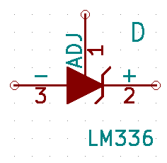
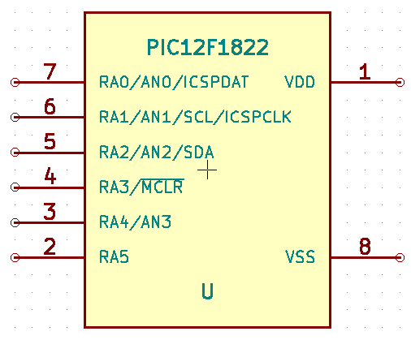
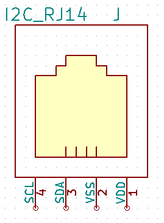
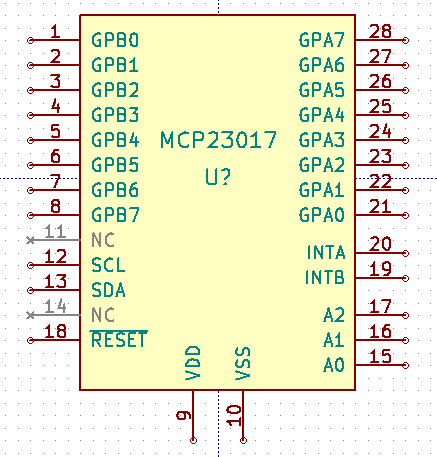
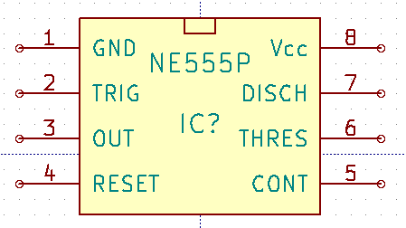
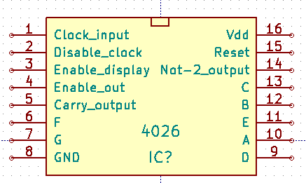
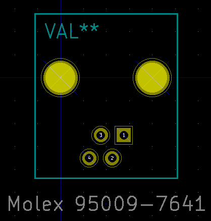

KiCad Library by simlun
=======================

Components
----------

LM336:

INA126:

PIC12F1822:

I2C_RJ14:

MCP23017:

NE555P:

4026:

Footprints
----------

Molex 95009-7641 RJ14 6P4C:

License
-------

This work is licensed under the Creative Commons Attribution-ShareAlike 4.0 International License. To view a copy of this license, visit http://creativecommons.org/licenses/by-sa/4.0/ or send a letter to Creative Commons, PO Box 1866, Mountain View, CA 94042, USA.

